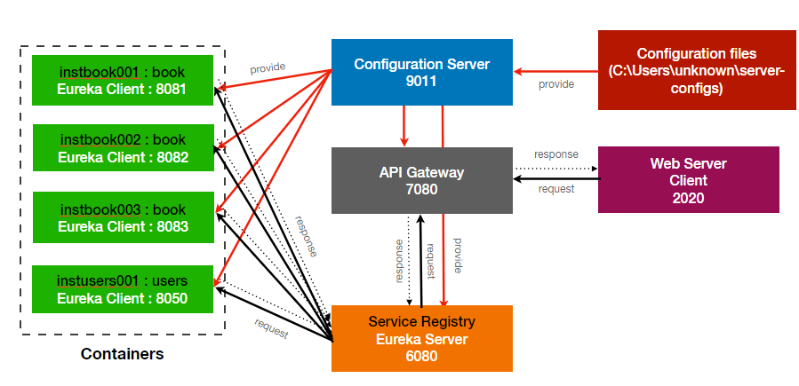

## Micro Service Project Structure

### 프로젝트 전체 구조



### Spring Cloud Config 
Spring Cloud Config 는 Git 혹은 시스템 상의 properties 파일들을 한곳에서 관리하도록 도와주는 서버입니다.
gradle build dependencies 에 Spring Cloud Config를 추가하고 
application.yml 파일에 아래와 같이 설정합니다.
그리고 @SpringBootApplication 어노테이션과 함께
@EnableConfigServer 어노테이션을 추가합니다. 

```
## application.yml
 
spring:
  cloud:
    config:
      server:
        native:
          search-locations: file:///${user.home}/server-configs
```

### Spring Cloud Gateway

Web Client 요청시 Gateway 는 ServiceRegistry에 등록되어 있는 서비스로 요청합니다.

아래와 같이 dependency를 추가하고 application.yml에 설정을 추가하면 
해당 서비스로 요청이 올때 설정이 된 인스턴스명으로 service registry에 요청을 합니다.

```
## build.gradle

    implementation 'org.springframework.cloud:spring-cloud-starter-config'
    implementation "org.springframework.cloud:spring-cloud-starter-gateway"
    implementation 'org.springframework.cloud:spring-cloud-starter-netflix-eureka-client'
    implementation "org.springframework.boot:spring-boot-starter-actuator"
    implementation 'io.projectreactor:reactor-core'
```


```
## application.yml

spring:
  application:
    name: gateway
  profiles:
    active: native
  cloud:
    config:
      uri: http://localhost:9011
    gateway:
      discovery:
        locator:
          enabled: true
      default-filters:
      - name: GlobalFilter
        args:
          baseMessage: Spring Cloud Gateway GlobalFilter
          preLogger: true
          postLogger: true
      routes:
      - id: book
        uri: lb://book
        predicates:
        - Path=/book/**
        filters:
        - name: BookFilter
          args:
            baseMessage: Spring Cloud Gateway BookFilter
            preLogger: true
            postLogger: true
      - id: users
        uri: lb://users
        predicates:
        - Path=/users/**
        filters:
        - name: UsersFilter
          args:
            baseMessage: Spring Cloud Gateway UsersFilter
            preLogger: true
            postLogger: true

```

Gateway에서는 Global Filter 를 통해 모든 요청에 대한 처리를 대응할 수 있고, 
url pattern을 설정하여 특정 패턴을 처리하는 Filter를 적용할 수 있습니다.


### Service Registry (Eureka Server)

서비스 레지스트리는 관리하고자 하는 여러 서비스들의 정보를 담고 있는 서비스를 관리하는 서버입니다.
Application.java 에 @SpringBootApplication 어노테이션과 함께 @EnableEurekaServer를 붙여준 뒤,
아래와 같이 bootstrap.yml(혹은 application.yml) 에 client 정보를 설정합니다. 


```
    ## build.gradle

    implementation 'org.springframework.cloud:spring-cloud-starter-netflix-eureka-server'
    implementation 'org.springframework.cloud:spring-cloud-starter-bootstrap'
    implementation 'org.springframework.cloud:spring-cloud-starter-config'
    implementation 'org.springframework.boot:spring-boot-starter-actuator'
```


```
## application.yml

eureka:
  instance:
    hostname: localhost
  client:
    register-with-eureka: false
    fetch-registry: false
    serviceUrl:
      defaultZone: http://${eureka.instance.hostname}:${server.port}/eureka/

```


### Services (Eureka Client)

단위 서비스를 제공하는 서버로서, Service Registry를 바라보고 요청에 응답합니다.
@SpringBootApplication 에 @EnableDiscoveryClient 를 추가해줍니다.
아래와 같이 설정을 추가하면 클라이언트 서버로 올라가며 해당 서버 정보를 Service Registry에 등록해두면
주기적으로 Heartbeat를 통해 Eureka Server 에 서비스가 살아있는지 확인하게 됩니다.


```
    ## build.gradle
    
    implementation 'org.springframework.cloud:spring-cloud-starter-bootstrap'
    implementation 'org.springframework.cloud:spring-cloud-starter-netflix-eureka-client'
    implementation 'org.springframework.boot:spring-boot-starter-actuator'
    implementation 'io.projectreactor:reactor-core'
    
```


```
## bootstrap.yml

eureka:
  instance:
    instance-id: instusers001
  client:
    service-url:
      defaultZone: http://localhost:6080/eureka/

```


