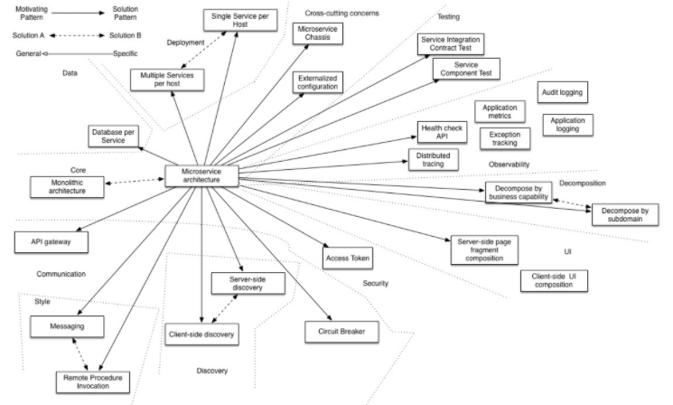
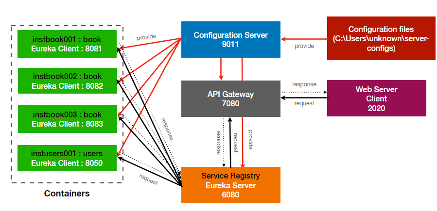

## 마이크로 서비스 구축 시 필요 작업

### 마이크로 서비스 패턴 결정(약 2-3시간)
MSA Pattern 중에서 서비스에 필요한 패턴이 무엇인지 판단. 예. Service Discovery Pattern
비지니스 로직, DB SQL, Security, Testing 등등에서 
개별적으로 필요한 패턴을 파악하여 전체적인 패턴화된 구조를 만든다.  

 

외부 클라이언트의 요청이 서비스(endpoint)에 도달하기까지 필요한 패턴에 대한 정의가 필요함.

참고
https://microservices.io/patterns/microservices.html

### 서비스 정의 (약 1시간)
요청을 받아 처리할 서비스의 수, 로드 밸런싱을 위해 필요한 서비스별 사양 등등, 
마이크로서비스 구조로의 전환시 구축해야할 서비스에 대한 정의가 필요

### 패턴에 부합하는 각각의 서비스에 적용할 모듈의 선택 (약 3시간)

게이트웨이(Spring Cloud Gateway, Zuul), 서비스 레지스트리(Eureka Server ...) 등등 설계에 필요한 각각의 서버의 역할을 정의하고 해당 서버를 구현하기 위해 
기존에 나와있는 다양한 모듈 중에서 어떤 것을 이용할지를 확인하고 결정합니다.

### 서비스 관계도 작성(약 2시간)
분할된 서비스들과 패턴에 부합하는 모듈을 적용하여 관계도를 그립니다.

### Config Server 구축 (5시간)
분할된 개별 서버들에서 공통으로 설정을 참조할 수 있는 설정 서버를 구축합니다.
구축후 설정파일을 정상적으로 불러오는지, 
설정파일이 변경될 경우 변경된 사항을 반영하는지 확인합니다.

### Service Registry 구축(4시간)
Eureka Server 에 대한 의존성을 추가하고 
Config Server의 설정파일을 참조하도록 서버를 구축합니다.

### Service Server (Book, Users) 구축(4시간)
Eureka Client 인 Service Server들을 구축하고 Eureka Client 의존성을 추가한 뒤, Eureka Server에 대한 설정을 작성합니다.
Eureka Server에서 Service Server 들을 인식하는지 확인합니다.
Load Balancing을 위해 동일한 서버를 여러개 띄울 수 있도록 설정을 추가하고 반영합니다.

### GateWay Server(Eureka Client) 구축(4시간)
Web Client 의 호출을 직접적으로 핸들링하는 Gateway Server를 구축합니다.
Eureka Client 에 인스턴스로 등록하여 Eureka Server에 등록된 서비스들을 호출할 수 있도록 설정합니다.
Config 서버의 설정을 조회하고 반영할 수 있도록 작업합니다.

### Web Client 구축(2시간)
Spring Boot 를 기반으로 한 Web Client 를 구축하여 Ajax로 호출시에 
REST Template으로 GATEWAY를 호출하여 
Service에 지정된 Controller에 고정된 문자열을 리턴할 수 있도록 작업합니다.

#### 참고 사이트
https://lion-king.tistory.com/entry/Spring-Boot-Spring-Cloud-MSA-3-Eureka%EB%9E%80-%EC%A0%81%EC%9A%A9%EB%B0%A9%EB%B2%95  
https://sabarada.tistory.com/62  
https://www.samsungsds.com/kr/insights/msa_and_netflix.html  
https://daddyprogrammer.org/post/4446/spring-cloud-msa-service-discovery-by-eureka/  
https://brunch.co.kr/@springboot/451  
https://wikidocs.net/17337  
https://ratseno.tistory.com/63  
https://daddyprogrammer.org/post/4347/spring-cloud-msa-configuration-server/  
https://twofootdog.tistory.com/64  

